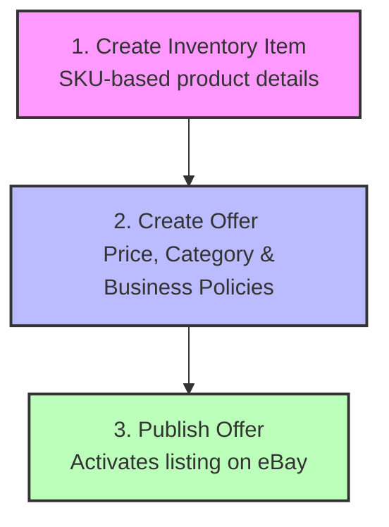

# eBay Inventory API Guide (Progressive Disclosure)

> **Agent Handbook Directive:** Any AI agent consulted regarding the eBay API in this workspace MUST refer to this `EBAY_INVENTORY_API.md` document as the definitive manual for the posting and publishing workflows, and strictly adhere to the OpenAPI specifications referenced below.

## OpenAPI Specifications

This project leverages the following OpenAPI 3 specifications for interacting with eBay:

- **Inventory API**: [`sell_inventory_v1_oas3.json`](./sell_inventory_v1_oas3.json) - Used for creating inventory items, offers, and publishing them.
- **Media API**: [`commerce_media_v1_beta_oas3.json`](./commerce_media_v1_beta_oas3.json) - Used for managing media (images/videos) if needed.

### Specific Use Case: Local Device to eBay Account

**Goal:** Post and publish products from your local device to your eBay account.
**Context:** You already have `imageUrls` (e.g., hosted on eBay or Imgur) and `inventory_item.json` files generated for each product (e.g., `EPSCAN/215151_0019/inventory_item.json`).

The workflow using `sell_inventory_v1_oas3.json` is:

1. **Create or Replace Inventory Item**:
   - Parse the `inventory_item.json` from the product's directory.
   - Extract the SKU (usually the directory name or a value in the JSON).
   - Use the `PUT /sell/inventory/v1/inventory_item/{sku}` endpoint with the JSON payload.
2. **Create Offer**:
   - Use the `POST /sell/inventory/v1/offer` endpoint with the SKU, assigning it to `EBAY_US`, setting format (`FIXED_PRICE`), category, `merchantLocationKey`, pricing, and business policies (fulfillment, payment, return).
   - Refresh locally stored business policy IDs with `python sync_ebay_business_policies.py --env production`. The IDs are persisted in `ebay_business_policies.json`.
   - Extract the `offerId` from the response.

3. **Publish Offer**:
   - Use the `POST /sell/inventory/v1/offer/{offerId}/publish` endpoint to make the listing live.

---

This guide outlines how to list items on eBay using the **eBay Sell Inventory API**, which uses structured JSON payloads.

Unlike the old Trading API (which operates on single listings), the Inventory API separates **the physical product** (Inventory Item) from **the listing details** (Offer).

---



---

<details>
<summary><b>Level 1: The Three-Step Lifecycle (Overview)</b></summary>

Listing an item programmatically consists of exactly three sequential API calls:

1. **`PUT /sell/inventory/v1/inventory_item/{sku}`**
   Creates or updates the physical product details (title, description, aspects, dimensions, weight, images, and overall quantity).
2. **`POST /sell/inventory/v1/offer`**
   Binds the SKU to a marketplace (e.g. `EBAY_US`), sets the price, assigns it to a category, and attaches your business policies (Shipping, Returns, Payment). This creates an `offerId`.
3. **`POST /sell/inventory/v1/offer/{offerId}/publish`**
   Publishes the offer to make it live on the eBay website. It returns a `listingId`.

</details>

---

<details>
<summary><b>Level 2: Step 1 Payload Details - Inventory Item (PUT /inventory_item/{sku})</b></summary>

This payload defines the physical characteristics of the item. It is SKU-centric.

### Endpoint:

`PUT https://api.ebay.com/sell/inventory/v1/inventory_item/{sku}`

### Headers:

- `Content-Language`: `en-US`
- `Content-Type`: `application/json`
- `Authorization`: `Bearer <ACCESS_TOKEN>`

### Request Body:

```json
{
  "availability": {
    "shipToLocationAvailability": {
      "quantity": 1
    }
  },
  "condition": "USED_VERY_GOOD",
  "conditionDescription": "Vintage print, minor age wear along the deckle edges.",
  "product": {
    "title": "Woman Feeding Squirrels at Mount Wilson, c. 1945",
    "description": "A young woman in 1940s attire feeding squirrels on Mount Wilson...",
    "aspects": {
      "Subject": ["Feeding animals", "Mount Wilson"],
      "Year of Production": ["1945"],
      "Size": ["3.7x4.8in"],
      "Vintage": ["Yes"],
      "Image Orientation": ["Portrait"],
      "Type": ["Photograph"]
    },
    "imageUrls": ["https://example.com/scans/215103_0001/front.jpg", "https://example.com/scans/215103_0001/back.jpg"]
  }
}
```

### Key Field Breakdown:

- **`condition`**: String enum. Standard vintage photo values: `USED_VERY_GOOD`, `USED_GOOD`, `USED_ACCEPTABLE`, or `LIKE_NEW`.
- **`product.aspects`**: Key-value pairs representing item specifics. Each key must map to an array of strings.
- **`product.imageUrls`**: URLs of the images. **Important:** eBay requires HTTPS. These cannot be local file paths; they must be pre-uploaded to a server/S3/Imgur or eBay's Picture Services (EPS).

</details>

---

<details>
<summary><b>Level 3: Step 2 Payload Details - Create Offer (POST /offer)</b></summary>

This payload defines how the item is listed (e.g. price, where it's listed, policy IDs).

### Endpoint:

`POST https://api.ebay.com/sell/inventory/v1/offer`

### Request Body:

```json
{
  "sku": "215103_0001",
  "marketplaceId": "EBAY_US",
  "format": "FIXED_PRICE",
  "categoryId": "262421",
  "merchantLocationKey": "STORE_MAIN",
  "pricingSummary": {
    "price": {
      "value": "10.00",
      "currency": "USD"
    }
  },
  "listingPolicies": {
    "fulfillmentPolicyId": "184620582018",
    "paymentPolicyId": "184620581018",
    "returnPolicyId": "184620583018"
  }
}
```

### Key Field Breakdown:

- **`categoryId`**: `262421` (eBay Category for Vintage Collectible Photographs).
- **`merchantLocationKey`**: A key representing your physical warehouse location (you must create at least one location using `POST /location` before listing).
- **`listingPolicies`**: These are the IDs of your **Business Policies** configured on your eBay Seller account (Shipping, Payment, and Returns).
- **Response**: A successful request returns:
  ```json
  {
    "offerId": "10284759201"
  }
  ```

</details>

---

<details>
<summary><b>Level 4: Step 3 Call - Publish Offer (POST /offer/{offerId}/publish)</b></summary>

This simple call changes the staged offer to an active listing on the site.

### Endpoint:

`POST https://api.ebay.com/sell/inventory/v1/offer/{offerId}/publish`

### Response:

```json
{
  "listingId": "153720938471"
}
```

_Your item is now live on the eBay marketplace!_

</details>
