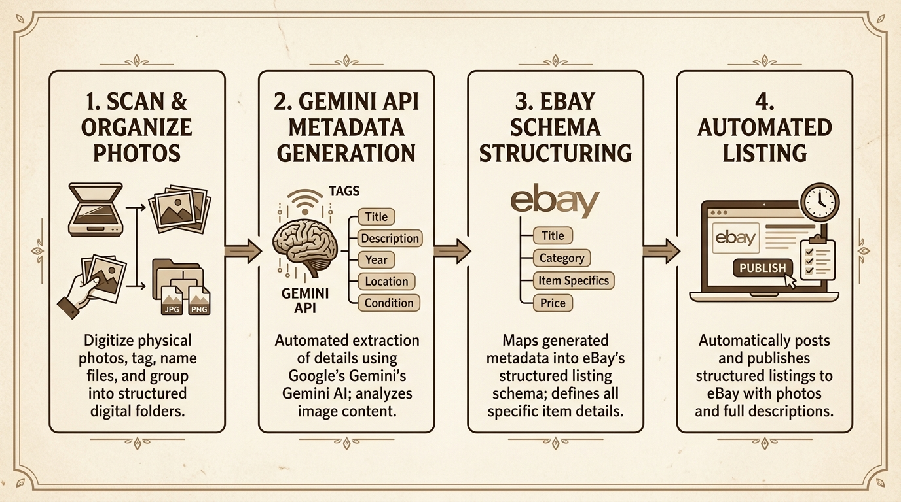

# Automated Vintage Photo Processing & eBay Listing Workflow

This project is an automated pipeline designed for a client who has a high-volume vintage photograph reselling business. It solves the tedious and labor-intensive task of manually inspecting physical photos, measuring dimensions, writing descriptions, categorizing, uploading images, and manually drafting listings on eBay.

By leveraging bulk local scanning, the **Google GenAI SDK (Gemini 3.5 Flash)** for multimodal image analysis, and the **eBay Sell Inventory API**, EPSCAN automates the entire lifecycle from raw scanned image pairs to active, live eBay listings in seconds.

---

---

## 📈 Key Efficiency Metrics

This workflow was built to optimize throughput, reduce labor overhead, and scale operations:

> [!IMPORTANT]
>
> - **Productivity Gain (Throughput):** **+566.67%** (Output rate increased from 60 photos/hour to 400 photos/hour; a 6.67× factor increase).
> - **Man-Hour Savings per Unit:** **85.00% reduction** (Time spent per photo decreased from 1.0 minute to 9.0 seconds).
> - **Direct Cost Savings per Unit:** **85.00% reduction** (Labor cost per photo dropped from $0.50 to $0.075).

## 📂 File Directory & Script Reference

| Script                                                                         | Description                                                                                 |
| :----------------------------------------------------------------------------- | :------------------------------------------------------------------------------------------ |
| [organize_photos.py](file:///Users/agustinbjr/Ebay/organize_photos.py)         | Scans a folder for raw JPEGs, pairs them sequentially, and moves them to subfolders.        |
| [fix_orientations.py](file:///Users/agustinbjr/Ebay/fix_orientations.py)       | Rotates images to correct vertical alignment.                                               |
| [generate_metadata.py](file:///Users/agustinbjr/Ebay/generate_metadata.py)     | Runs multimodal inference via the Google GenAI SDK to generate structured `metadata.json`.  |
| [update_local_themes.py](file:///Users/agustinbjr/Ebay/update_local_themes.py) | Matches and updates metadata with category-specific eBay themes using Gemini.               |
| [migrate_themes.py](file:///Users/agustinbjr/Ebay/migrate_themes.py)           | Converts generated themes into inventory specifics inside `inventory_item.json`.            |
| [storeImages.py](file:///Users/agustinbjr/Ebay/storeImages.py)                 | Programmatically uploads local photo pairs to the eBay Picture Server (EPS).                |
| [run_ebay_workflow.py](file:///Users/agustinbjr/Ebay/run_ebay_workflow.py)     | Orchestrator that triggers the full eBay upload, listing creation, and activation workflow. |
