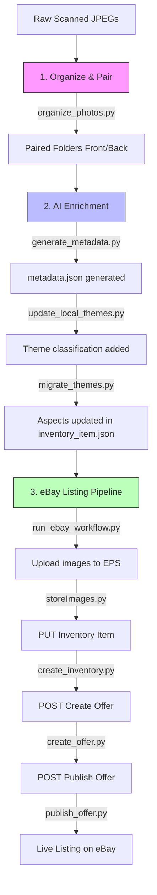

# EPSCAN: Automated Vintage Photo Processing & eBay Listing Workflow

EPSCAN is a high-throughput, automated pipeline designed for high-volume vintage photograph resellers. It solves the tedious and labor-intensive task of manually inspecting physical photos, measuring dimensions, writing descriptions, categorizing, uploading images, and manually drafting listings on eBay. 

By leveraging bulk local scanning, the **Google GenAI SDK (Gemini 3.5 Flash)** for multimodal image analysis, and the **eBay Sell Inventory API**, EPSCAN automates the entire lifecycle from raw scanned image pairs to active, live eBay listings in seconds.

---

## 📈 Key Efficiency Metrics

This workflow was built to optimize throughput, reduce labor overhead, and scale operations:

> [!IMPORTANT]
> * **Productivity Gain (Throughput):** **+566.67%** (Output rate increased from 60 photos/hour to 400 photos/hour; a 6.67× factor increase).
> * **Man-Hour Savings per Unit:** **85.00% reduction** (Time spent per photo decreased from 1.0 minute to 9.0 seconds).
> * **Direct Cost Savings per Unit:** **85.00% reduction** (Labor cost per photo dropped from $0.50 to $0.075).

---

## ⚙️ Core Architecture & Workflow

The system is structured as an interconnected sequence of modular scripts that process scanned photographs in three main phases:



### Phase 1: Local Image Processing
* **Sequential Pairing:** Raw scans are grouped in sequential pairs `(n, n+1)` representing the front and back of a photo and organized into item-specific subfolders.
* **Orientation Correction:** Script utilities analyze and fix image rotations to ensure front and back views are oriented correctly for buyers.

### Phase 2: Multimodal AI Enrichment
* **Gemini Metadata Generation:** The script feeds both the front and back of the photo to the Gemini model, extracting titles (under 80 characters), historical descriptions, production years, locations, and structural metadata. It uses handwriting, stamps, or markings on the back of the photo to infer context.
* **Aspect Mapping:** System specifics (Vintage, Style, Orientation, Size, Material) are auto-classified and mapped directly to Pydantic-enforced schemas for eBay inventory aspects.

### Phase 3: eBay API Integration
* **eBay Picture Services (EPS):** Local JPEGs are programmatically uploaded to official eBay image servers, returning the required secure HTTPS URLs.
* **Three-Step Listing Lifecycle:**
  1. **PUT Inventory Item:** Registers physical details and aspect mappings under a unique SKU.
  2. **Create Offer:** Sets fixed price, marketplace (`EBAY_US`), category (`262421`), and attaches seller shipping/payment/return business policies.
  3. **Publish Offer:** Activates the listing, making it live on the site.

---

## 📂 File Directory & Script Reference

| Script | Description |
| :--- | :--- |
| [organize_photos.py](file:///Users/agustinbjr/Ebay/organize_photos.py) | Scans a folder for raw JPEGs, pairs them sequentially, and moves them to subfolders. |
| [fix_orientations.py](file:///Users/agustinbjr/Ebay/fix_orientations.py) | Rotates images to correct vertical alignment. |
| [generate_metadata.py](file:///Users/agustinbjr/Ebay/generate_metadata.py) | Runs multimodal inference via the Google GenAI SDK to generate structured `metadata.json`. |
| [update_local_themes.py](file:///Users/agustinbjr/Ebay/update_local_themes.py) | Matches and updates metadata with category-specific eBay themes using Gemini. |
| [migrate_themes.py](file:///Users/agustinbjr/Ebay/migrate_themes.py) | Converts generated themes into inventory specifics inside `inventory_item.json`. |
| [storeImages.py](file:///Users/agustinbjr/Ebay/storeImages.py) | Programmatically uploads local photo pairs to the eBay Picture Server (EPS). |
| [run_ebay_workflow.py](file:///Users/agustinbjr/Ebay/run_ebay_workflow.py) | Orchestrator that triggers the full eBay upload, listing creation, and activation workflow. |

---

## 🚀 Setup & Installation

### 1. Environment Activation
Activate the Python virtual environment and ensure dependencies are installed:
```bash
source .venv/bin/activate
pip install -r requirements.txt
```

### 2. Configure Credentials
Create a local, git-ignored file named `ebay_credentials.json` in the project root:
```json
{
    "sandbox": {
        "client_id": "YOUR_SANDBOX_CLIENT_ID",
        "client_secret": "YOUR_SANDBOX_CLIENT_SECRET",
        "ru_name": "YOUR_SANDBOX_RU_NAME"
    },
    "production": {
        "client_id": "YOUR_PRODUCTION_CLIENT_ID",
        "client_secret": "YOUR_PRODUCTION_CLIENT_SECRET",
        "ru_name": "YOUR_PRODUCTION_RU_NAME"
    }
}
```
*Note: Make sure your `GEMINI_API_KEY` is loaded as an environment variable:*
```bash
export GEMINI_API_KEY="your-gemini-api-key"
```

### 3. Generate OAuth Tokens
Run the token loader utility to authenticate with eBay and fetch OAuth tokens:
```bash
source load_token.sh sandbox
# or for production:
source load_token.sh production
```

---

## 📖 Basic Usage

### Step 1: Pair Scans
Organize your raw scanned photos:
```bash
python organize_photos.py /path/to/raw/scans
```

### Step 2: Generate Metadata & Themes
Run metadata generation on the folder:
```bash
python generate_metadata.py /path/to/organized-folder
python update_local_themes.py /path/to/organized-folder
python migrate_themes.py /path/to/organized-folder
```

### Step 3: Publish to eBay
Run the orchestrator script to host the images and publish the listing:
```bash
python run_ebay_workflow.py --env sandbox /path/to/item-folder
```
